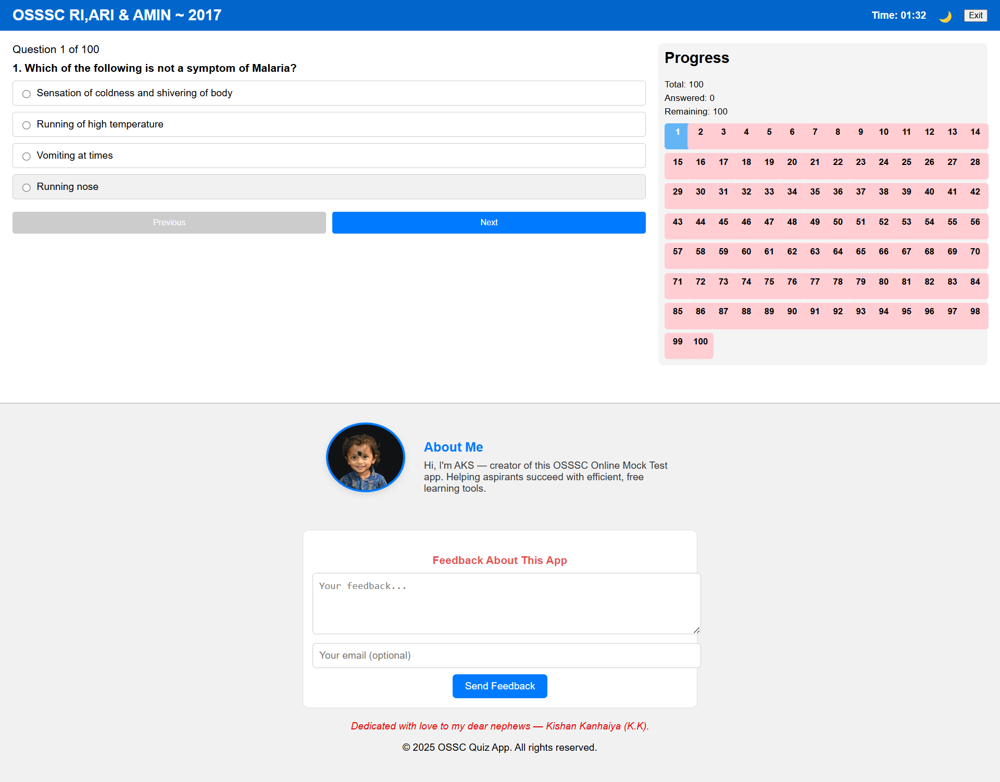
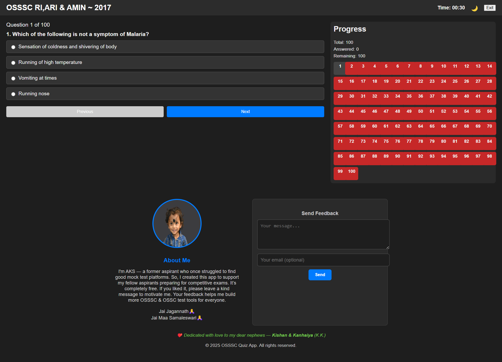

# OSSSC-MCQ-TEST

# OSSSC Online Mock Test App

Welcome to the OSSSC Quiz App — a fully responsive, feature-rich online mock test platform for aspirants preparing for competitive exams like OSSSC, OSSC, and more.  
This application is **completely free** and created with love and purpose by a fellow student who once walked the same journey.

---

## ✨ Features

- 📝 100 Multiple Choice Questions (MCQs) per test
- 🕒 Auto timer with countdown & auto-submit
- 📊 Real-time progress tracking (answered, unanswered)
- 📍 Jump-to-any-question navigation
- ✅ Answer review with correct/incorrect feedback
- 🌓 Dark Mode toggle
- 🔖 Bookmark questions for later
- 📱 Mobile + Touch optimized (swipe support)
- 💾 LocalStorage for answer recovery on reload
- 📥 Download answer key (PDF format)
- 💬 Built-in feedback form (Formspree integration)

---

## 📸 Screenshots
#NORMAL VIEW

#Dark Mode On

---

## 🚀 Live Demo

You can try the app here: https://devamit09.github.io/OSSSC-MCQ-TEST/

---

## 📂 Folder Structure

📁 osssc-quiz-app/ ├── index.html ├── styles.css ├── script.js ├── quizData.js └── README.md

---

## 🔧 Tech Stack

- HTML5 + CSS3 (Responsive Design)
- JavaScript (Vanilla)
- jsPDF (for PDF download)
- Formspree (for contact form handling)

---

## ❤️ About the Creator

Hi, I'm **AKS** — a former aspirant who struggled to find free mock test tools. That experience motivated me to build this platform for my fellow brothers, sisters, and friends preparing for government exams.

> If you like this app or find it useful, please leave encouraging feedback. It helps me stay motivated to keep improving and to build more tools like this in the future.

---

## 🎁 Dedication

**Dedicated with love to my dear nephews — Kishan & Kanhaiya (K.K.).**

---

## 📬 Feedback

Found a bug? Want to suggest an improvement? Use the built-in feedback form or raise an issue here on GitHub.

---

## 📄 License

This project is open source and free to use under the [MIT License](LICENSE).
